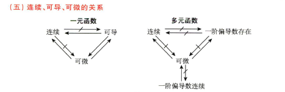

- [第五章 多元函数微分学](#第五章-多元函数微分学)
- [第一节  重极限、连续、偏导数、全微分（概念、理论）](#第一节--重极限连续偏导数全微分概念理论)
  - [一、考试内容要点精讲](#一考试内容要点精讲)
    - [（一）重极限](#一重极限)
    - [（二）连续](#二连续)
    - [（三）偏导数](#三偏导数)
    - [（四）全微分](#四全微分)
- [第二节  偏导数与全微分的计算](#第二节--偏导数与全微分的计算)
  - [一、考试内容要点精讲](#一考试内容要点精讲-1)
    - [1. 复合函数求导法](#1-复合函数求导法)
    - [2. 全微分形式不变性](#2-全微分形式不变性)
    - [3. 隐函数求导法](#3-隐函数求导法)
- [第三节  极值与最值](#第三节--极值与最值)
  - [一、考试内容要点精讲](#一考试内容要点精讲-2)
    - [（一）无条件极值](#一无条件极值)
    - [（二）条件极值及拉格朗日乘数法](#二条件极值及拉格朗日乘数法)
    - [（三）最大最小值](#三最大最小值)
  - [二、常考题型的方法与技巧](#二常考题型的方法与技巧)

# 第五章 多元函数微分学

# 第一节  重极限、连续、偏导数、全微分（概念、理论）

## 一、考试内容要点精讲

### （一）重极限

**定义** 设函数 $f(x, y)$ 在区域 $D$ 上有定义，点 $P_0(x_0, y_0) \in D$ 为 $D$ 的聚点。如果 $\forall \varepsilon > 0$，存在 $\delta > 0$，当 $P(x, y) \in D$，且 $0 < \sqrt{(x - x_0)^2 + (y - y_0)^2} < \delta$ 时，都有

$$\left| f(x, y) - A \right| < \varepsilon$$

成立，则称常数 $A$ 为函数 $f(x, y)$ 当 $(x, y) \rightarrow (x_0, y_0)$ 时的极限，记为

$\lim_{(x, y) \rightarrow (x_0, y_0)} f(x, y) = A$ 或 $\lim_{\substack{x \rightarrow x_0 \\ y \rightarrow y_0}} f(x, y) = A$ 或 $\lim_{P \rightarrow P_0} f(P) = A$。

**注** (1) 这里的极限是要求点 $(x, y)$ 在 $D$ 内以任意方式趋近于点 $(x_0, y_0)$ 时，函数 $f(x, y)$ 都趋近于同一确定的常数 $A$，否则该极限就不存在。

(2) 一元函数极限中的下述性质对多元函数仍成立

① 局部有界性；　　② 保号性；　　③ 有理运算；　　④ 极限与无穷小的关系；　　⑤ 夹逼性。

**注** 求重极限常用方法

1. 利用极限性质(四则运算法则, 夹通原理);

2. 消去分母中极限为零的因子(有理化, 等价无穷小代换);

3. 利用无穷小量与有界变量之积为无穷小量。

**注** 证明重极限不存在的常用方法: 沿两种不同路径得到的极限不同(通常可取过点(x₀, y₀)的直线)。

### （二）连续

**定义** 若 $\lim\limits_{(x,y) \to (x_0, y_0)} f(x,y) = f(x_0, y_0)$，则称 $f(x,y)$ 在点 $(x_0, y_0)$ 处连续。

注：多元连续函数的复合函数也是连续函数。

**性质**
1. 连续函数的和、差、积、商（分母不为零）及复合仍连续；
2. 基本初等函数在其定义域内连续，初等函数在其定义区间内连续；
3. 有界闭区域上连续函数的性质：
   - 有界性：若 $f(x,y)$ 在有界闭区域 $D$ 上连续，则 $f(x,y)$ 在 $D$ 上有界。
   - 最值性：若 $f(x,y)$ 在有界闭区域 $D$ 上连续，则 $f(x,y)$ 在 $D$ 上必有最大值和最小值。
   - 介值性：若 $f(x,y)$ 在有界闭区域 $D$ 上连续，则 $f(x,y)$ 在 $D$ 上可取到介于最大值与最小值之间的任何值。

### （三）偏导数

1. **定义**

$ f_x'(x_0, y_0) = \lim_{\Delta x \to 0} \frac{f(x_0 + \Delta x, y_0) - f(x_0, y_0)}{\Delta x} = \left. \frac{\mathrm{d}}{\mathrm{d}x} f(x, y_0) \right|_{x = x_0}, $

$ f_y'(x_0, y_0) = \lim_{\Delta y \to 0} \frac{f(x_0, y_0 + \Delta y) - f(x_0, y_0)}{\Delta y} = \left. \frac{\mathrm{d}}{\mathrm{d}y} f(x_0, y) \right|_{y = y_0}. $

**注** $f_x'(x_0, y_0)$ 就是一元函数 $f(x, y_0)$ 在 $x_0$ 处的导数；$f_y'(x_0, y_0)$ 就是一元函数 $f(x_0, y)$ 在 $y_0$ 处的导数。

1. **几何意义**

$f_x'(x_0, y_0)$ 表示曲线 $z = f(x, y_0)$ 在点 $(x_0, y_0, f(x_0, y_0))$ 处的切线对 $x$ 轴的斜率；
$f_y'(x_0, y_0)$ 表示曲线 $z = f(x_0, y)$ 在点 $(x_0, y_0, f(x_0, y_0))$ 处的切线对 $y$ 轴的斜率。

3. **高阶偏导数**

设 z = f(x, y)，则

$$
\frac{\partial^2 z}{\partial x^2} = f_{xx}''(x, y) = \frac{\partial}{\partial x} \left( \frac{\partial z}{\partial x} \right), \quad \frac{\partial^2 z}{\partial x \partial y} = f_{xy}''(x, y) = \frac{\partial}{\partial y} \left( \frac{\partial z}{\partial x} \right),
$$

$$
\frac{\partial^2 z}{\partial y \partial x} = f_{yx}''(x, y) = \frac{\partial}{\partial x} \left( \frac{\partial z}{\partial y} \right), \quad \frac{\partial^2 z}{\partial y^2} = f_{yy}''(x, y) = \frac{\partial}{\partial y} \left( \frac{\partial z}{\partial y} \right).
$$

**定理** 如果函数 z = f(x, y) 的两个二阶混合偏导数 $f_{xy}''(x, y)$ 及 $f_{yx}''(x, y)$ 在区域 D 内连续，则在区域 D 内恒有
 $$f_{xy}''(x, y) = f_{yx}''(x, y).$$ 

### （四）全微分

1. **定义**

若 $\Delta z = f(x₀ + \Delta x, y₀ + \Delta y) - f(x₀, y₀) = A \Delta x + B \Delta y + o(\rho)$，则称函数 $z = f(x, y)$ 在点（$x₀, y₀$）可微，$A \Delta x + B \Delta y$ 称为函数 $z = f(x, y)$ 在点（$x₀, y₀$）的全微分，记为

$$
\mathrm{d}z = A \Delta x + B \Delta y.
$$

**注** 以下四条等价

(1) $\Delta z = f(x₀ + \Delta x, y₀ + \Delta y) - f(x₀, y₀) = A \Delta x + B \Delta y + o(\rho)$；

(2) $\lim_{\Delta x \to 0, \Delta y \to 0} \frac{[f(x₀ + \Delta x, y₀ + \Delta y) - f(x₀, y₀)] - [A \Delta x + B \Delta y]}{\sqrt{(\Delta x)^2 + (\Delta y)^2}} = 0$；

(3) $\Delta z = f(x, y) - f(x₀, y₀) = A(x - x₀) + B(y - y₀) + o(\rho)$；

(4) $\lim_{x \to x₀, y \to y₀} \frac{[f(x, y) - f(x₀, y₀)] - [A(x - x₀) + B(y - y₀)]}{\sqrt{(x - x₀)^2 + (y - y₀)^2}} = 0$。

它们是函数 $f(x, y)$ 在点（$x₀, y₀$）处可微的等价形式，由它们都可得到 $f_x'(x₀, y₀) = A$, $f_y'(x₀, y₀) = B$。

它们是函数 f(x, y) 在点 (x₀, y₀) 处可微的等价形式，由它们都可得到 f(x, y) 在点 (x₀, y₀) 处可微，且 $f_x'(x₀, y₀) = A$, $f_y'(x₀, y₀) = B$.

1. 可微性判定

(1) 必要条件：$f_x'(x₀, y₀)$ 与 $f_y'(x₀, y₀)$ 都存在；

(2) 充分条件：$f_x'(x, y)$ 和 $f_y'(x, y)$ 在 (x₀, y₀) 连续；

(3) 用定义判定：

① $f_x'(x₀, y₀)$ 与 $f_y'(x₀, y₀)$ 是否都存在？

② $\lim_{\Delta x \to 0，\Delta y \to 0} \frac{［f(x₀ + \Delta x，y₀ + \Delta y) - f(x₀，y₀)］ - ［f_x'(x₀，y₀) \Delta x + f_y'(x₀，y₀) \Delta y］}{\sqrt{（\Delta x）^2 + （\Delta y）^2}}
$是否为零？

1. 计算

若 f(x, y) 可微，则 $\mathrm{d}z = \frac{\partial f}{\partial x} \,\mathrm{d}x + \frac{\partial f}{\partial y} \,\mathrm{d}y.$

注：二重积分的计算：整体换元法，放缩法用夹逼准则，无穷小量与有界量的乘积是无穷小量，实际上的一元函数。

# 第二节  偏导数与全微分的计算

## 一、考试内容要点精讲

### 1. 复合函数求导法
设 $u = u(x, y)$，$v = v(x, y)$ 可导，$z = f(u, v)$ 在相应点有连续一阶偏导数，则
$$
\frac{\partial z}{\partial x} = \frac{\partial f}{\partial u} \frac{\partial u}{\partial x} + \frac{\partial f}{\partial v} \frac{\partial v}{\partial x}
$$
$$
\frac{\partial z}{\partial y} = \frac{\partial f}{\partial u} \frac{\partial u}{\partial y} + \frac{\partial f}{\partial v} \frac{\partial v}{\partial y}
$$

### 2. 全微分形式不变性
设 $z = f(u, v)$，$u = u(x, y)$，$v = v(x, y)$ 都有连续一阶偏导数，则
$$
dz = \frac{\partial z}{\partial x}dx + \frac{\partial z}{\partial y}dy,dz = \frac{\partial z}{\partial u}du + \frac{\partial z}{\partial v}dv
$$

### 3. 隐函数求导法
（1）由一个方程所确定的隐函数
设 $F(x, y, z)$ 有连续一阶偏导数，$F'_z \neq 0$，$z = z(x, y)$ 则 $F(x, y, z) = 0$ 所确定。

**方法**
1. 公式：
$$
\frac{\partial z}{\partial x} = -\frac{F'_x}{F'_z}, \quad \frac{\partial z}{\partial y} = -\frac{F'_y}{F'_z}
$$
2. 等式两边求导：$F'_x + F'_z \frac{\partial z}{\partial x} = 0$，$F'_y + F'_z \frac{\partial z}{\partial y} = 0$
3. 利用微分形式不变性：$F'_xdx + F'_y dy + F'_z dz = 0$
4. 由方程组所确定的隐函数

设 $u = u(x, y)$，$v = v(x, y)$，由 $F(x, y, u, v) = 0$，$G(x, y, u, v) = 0$ 所确定。

**方法**
① 等式两边求导

$$
\begin{cases}
F_{x}^{\prime} + F_{u}^{\prime} \frac{\partial u}{\partial x} + F_{v}^{\prime} \frac{\partial v}{\partial x} = 0, \\
G_{x}^{\prime} + G_{u}^{\prime} \frac{\partial u}{\partial x} + G_{v}^{\prime} \frac{\partial v}{\partial x} = 0;
\end{cases}
$$

② 利用微分形式不变性

$$
\begin{cases}
F_{x}^{\prime} \mathrm{d}x + F_{y}^{\prime} \mathrm{d}y + F_{u}^{\prime} \mathrm{d}u + F_{v}^{\prime} \mathrm{d}v = 0, \\
G_{x}^{\prime} \mathrm{d}x + G_{y}^{\prime} \mathrm{d}y + G_{u}^{\prime} \mathrm{d}u + G_{v}^{\prime} \mathrm{d}v = 0.
\end{cases}
$$

**题型一** 求一点处的偏导数与全微分

**题型二** 求已给出具体表达式函数的偏导数与全微分

**题型三** 含有抽象函数的复合函数偏导数与全微分

**题型四** 隐函数的偏导数与全微分

# 第三节  极值与最值

## 一、考试内容要点精讲

### （一）无条件极值

**定义** 设函数 z = f(x, y) 在点 $P(x_0, y_0)$ 的某邻域内有定义，若对该邻域内任意的点 $P(x_0, y_0)$ 均有

$$ f(x, y) \leq f(x_0, y_0) \quad \text{(或} \; f(x, y) \geq f(x_0, y_0)\text{)} $$

则称 $(x_0, y_0)$ 为 f(x, y) 的极大值点（或极小值点）；称 $f(x_0, y_0)$ 为 f(x, y) 的极大值（或极小值）。极大值点和极小值点统称为极值点；极大值和极小值统称为极值。

**定理 1**（极值的必要条件）设 z = f(x, y) 在点 $(x_0, y_0)$ 存在偏导数，且 $(x_0, y_0)$ 为 f(x, y) 的极值点，则

$$ f_x'(x_0, y_0) = 0, \quad f_y'(x_0, y_0) = 0. $$

**定理 2**（极值的充分条件）设 z = f(x, y) 在点 $P_0(x_0, y_0)$ 的某邻域内有二阶连续偏导数，且 $f_x'(x_0, y_0) = f_y'(x_0, y_0) = 0$。记

$$ A = f_{xx}''(x_0, y_0), \; B = f_{xy}''(x_0, y_0), \; C = f_{yy}''(x_0, y_0). $$

则有下述结论：

(1) 若 AC - B² > 0，则 $(x_0, y_0)$ 为 f(x, y) 的极值点。
    ① A < 0，则 $(x_0, y_0)$ 为 f(x, y) 的极大值点；
    ② A > 0，则 $(x_0, y_0)$ 为 f(x, y) 的极小值点。

(2) 若 AC - B² < 0，则 $(x_0, y_0)$ 不为 f(x, y) 的极值点。

(3) 若 AC - B² = 0，则 $(x_0, y_0)$ 可能为 f(x, y) 的极值点，也可能不为 f(x, y) 的极值点（此时一般用定义判定）。

求具有二阶连续偏导数二元函数 z = f(x, y) 极值的一般步骤：

(1) 求出 f(x, y) 的驻点 $P_1, ..., P_n$。

(2) 利用极值的充分条件判定驻点 $P_i$ 是否为极值点。

**注** 二元函数 z = f(x, y) 在偏导数不存在的点也可能取到极值(如$f(x，y) = \sqrt{（x^2 + y^2）}
$)，而这种点是否取得极值一般用极值定义判定。

### （二）条件极值及拉格朗日乘数法
 
（二）条件极值及拉格朗日乘数法

求 $z = f(x，y)$ 在条件 $\varphi(x，y) = 0$ 下的条件极值的一般方法为：

(1) 构造拉格朗日函数 $F(x，y，\lambda) = f(x，y) + \lambda \varphi(x，y)$；

(2) 将 $F(x，y，\lambda)$ 分别对 $x, y, \lambda$ 求偏导数，构造方程组

$$
\begin{cases}
f_x'(x，y) + \lambda \varphi_x'(x，y) = 0，\\
f_y'(x，y) + \lambda \varphi_y'(x，y) = 0，\\
\varphi(x，y) = 0。
\end{cases}
$$

解出 $x, y$ 及 $\lambda$，则其中（$x，y$）就是函数 $f(x，y)$ 在条件 $\varphi(x，y) = 0$ 下的可能的极值点。

以上方法可推广到对于 $n$ 元函数在 $m$ 个约束条件下的极值问题，如求 $u = f(x，y，z)$ 在条件 $\varphi(x，y，z) = 0$，$\psi(x，y，z) = 0$ 下的极值，可构造拉格朗日函数。

$$
F(x, y, z, \lambda, \mu) = f + \lambda \varphi + \mu \psi.
$$

将 $F$ 对 $x, y, z, \lambda$ 及 $\mu$ 分别求偏导数，并构造方程组：

$$
\begin{cases}
f_x'(x, y, z) + \lambda \varphi_x'(x, y, z) + \mu \psi_x'(x, y, z) = 0, \\
f_y'(x, y, z) + \lambda \varphi_y'(x, y, z) + \mu \psi_y'(x, y, z) = 0, \\
f_z'(x, y, z) + \lambda \varphi_z'(x, y, z) + \mu \psi_z'(x, y, z) = 0, \\
\varphi(x, y, z) = 0, \\
\psi(x, y, z) = 0.
\end{cases}
$$

解出 $x, y, z, \lambda$ 及 $\mu$，则其中（$x, y, z$）就是可能的极值点。

对于实际问题，如果驻点唯一，且由实际意义知问题存在最大(小)值，则该驻点即为最大(小)值点。如果存在多个驻点，且由实际意义知道问题既存在最大值也存在最小值，只需比较各驻点处的函数值，最大的则为最大值，最小的则为最小值。

### （三）最大最小值

1. **求连续函数 f(x, y) 在有界闭域 D 上的最大最小值三部曲**：

    ① 求 f(x, y) 在 D 内部可能的极值点；

    ② 求 f(x, y) 在 D 的边界上的最大最小值；

    ③ 比较。

2. 应用题

**注**：极值点不一定是驻点，驻点不一定是极值点。
可能的极值点：
(1)驻点。
(2)$f_x'$$f_y'$都不存在
(3)$f_x'$不存在$f_y'$存在
(4)$f_x'$存在$f_y'$不存在。

## 二、常考题型的方法与技巧

**题型一** 求无条件极值

**题型二** 求最大最小值

